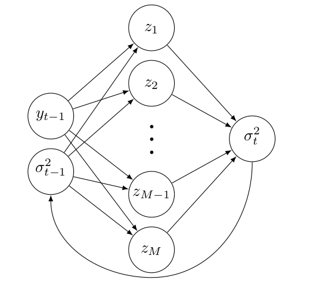

# Recurrent Neural Net predicting Stock volatility

<p align="center">
  
</p>

This repository contains Python code to train a recurrent Neural Network which tries to model the volatility of the daily returns of the SP500 index.

## To run the code

Download the repository content by clicking "Download ZIP" and unzipping to a folder on your machine.

Download a Python 3.x interpreter from [here](https://www.python.org/downloads/). Or to make sure all the neccesary modules are installed in one go, download and install the Anaconda module packages, which also comes with a Python 3 interpreter. The Anaconda package can be downloded [here](https://www.continuum.io/downloads).

When Python (and the appropriate packages) are dowloaded. Simply type one of the following commands in your command prompt:

```
python train_GARCH.py
python train_RNN.py 
python VaR_GARCH.py
python VaR_RNN.py
```

The first two scripts estimates the GARCH(1,1)-model and the Jordan Neural network with 5 hidden layers on the SP500 daily returns and saves the output in a JSON-file, named GARCH_est_<timestamp>.json, for the ARCH model and Jordan_est_<timestamp>.json for the Neural Network model.

The two scripts: VaR_GARCH and VaR_RNN produces some VaR plots which are saved in your_folder/plots.

## Data
 
The data come from Yahoo fianance https://finance.yahoo.com/q?s=^GSPC and is located in a CSV file in the data-folder.

## Paper

This code was made for a University paper. A draft version of the paper in PDF can also be found in the repository, named RNN_GARCH_paper.pdf.
